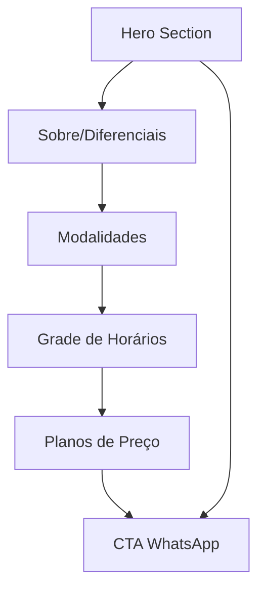

## 1. Product Overview
Landing page moderna e de alta performance para Academia Performance, focada em conversão de leads e SEO. A página apresenta as modalidades, planos e diferenciais da academia com design dark mode e otimização para Google Lighthouse 95+.

Produto voltado para potenciais alunos em busca de musculação e jiu-jitsu em Ipameri-GO, com foco em conversão através de CTAs estratégicos para WhatsApp.

## 2. Core Features

### 2.1 User Roles
Esta é uma landing page institucional sem autenticação de usuários.

### 2.2 Feature Module
Landing page com as seguintes seções principais:
1. **Header/Navbar**: Logo, navegação com scroll suave e CTA principal
2. **Hero Section**: Headline impactante, subtítulo e botão CTA com background otimizado
3. **Sobre/Diferenciais**: Apresentação da academia com ícones destacando modalidades
4. **Modalidades**: Cards interativos de musculação e jiu-jitsu
5. **Grade de Horários**: Tabela responsiva de horários das aulas
6. **Planos de Preço**: Cards de preços com destaque para plano mais vantajoso
7. **Footer**: Informações de contato, endereço e redes sociais

### 2.3 Page Details
| Page Name | Module Name | Feature description |
|-----------|-------------|---------------------|
| Landing Page | Header/Navbar | Logo estilizado, menu de navegação com scroll suave para seções, botão CTA "Matricule-se Agora" linkando para WhatsApp |
| Landing Page | Hero Section | Headline "Seu Primeiro Passo Para uma Vida Mais Ativa Começa Aqui", subtítulo persuasivo, botão CTA principal, background com imagem otimizada e overlay escuro |
| Landing Page | Sobre/Diferenciais | Texto sobre infraestrutura e ambiente, ícones destacando Jiu Jitsu, Musculação e Profissionais Experientes |
| Landing Page | Modalidades | Cards modernos para Musculação e Jiu Jitsu com efeito hover e descrições concisas |
| Landing Page | Grade de Horários | Tabela/lista responsiva exibindo horários, instrutores e vagas, com foco no horário 18:00-19:30 |
| Landing Page | Planos de Preço | Layout 3-4 colunas com cards de preços, destaque visual para plano mais vantajoso (Musculação + Jiu-Jitsu), botões de compra |
| Landing Page | Footer | Endereço completo de Ipameri-GO, horários de funcionamento, links redes sociais, copyright 2025 |

## 3. Core Process
**Fluxo do Visitante:**
1. Usuário acessa a landing page
2. Visualiza hero section com CTA principal
3. Scroll para explorar modalidades e diferenciais
4. Verifica grade de horários disponíveis
5. Analisa planos de preços
6. Clica em CTA para WhatsApp para matrícula

## 4. User Interface Design

### 4.1 Design Style
- **Cores**: Tema Dark Mode - Preto (#000000), Cinza Chumbo (#1a1a1a, #2d2d2d), Amarelo/Verde Neon (#ffff00, #00ff00) para acentos e CTAs
- **Tipografia**: Inter ou Roboto via Google Fonts, pesos 400, 600, 700
- **Botões**: Estilo moderno com bordas arredondadas, efeitos hover e sombras sutis
- **Layout**: Card-based com espaçamento generoso (whitespace), grid responsivo
- **Ícones**: SVG inline preferencialmente, FontAwesome ou Heroicons como alternativa

### 4.2 Page Design Overview
| Page Name | Module Name | UI Elements |
|-----------|-------------|-------------|
| Landing Page | Header/Navbar | Logo texto estilizado, menu hambúrguer mobile, links de navegação desktop, botão CTA amarelo neon com hover effect |
| Landing Page | Hero Section | Background imagem Unsplash com overlay preto 50%, texto branco com sombra, botão CTA grande e vibrante, tipografia hierárquica |
| Landing Page | Sobre/Diferenciais | Cards com ícones coloridos, texto com line-height otimizado, grid 3 colunas desktop/1 coluna mobile |
| Landing Page | Modalidades | Cards com imagem de fundo, overlay gradiente, título em destaque, descrição concisa, efeito hover scale |
| Landing Page | Grade de Horários | Tabela zebra stripes, cabeçalho sticky, células com padding generoso, responsiva com scroll horizontal |
| Landing Page | Planos de Preço | Cards com borda destacada para plano principal, badge "Mais Vantajoso", preços em destaque, lista de benefícios |
| Landing Page | Footer | Background escuro, texto cinza claro, ícones sociais circulares, mapa embed opcional |

### 4.3 Responsiveness
- **Abordagem**: Mobile-first design
- **Breakpoints**: Tailwind padrão (sm: 640px, md: 768px, lg: 1024px, xl: 1280px)
- **Otimização**: Touch-friendly com áreas de clique mínimas 44x44px, fontes legíveis em todas as resoluções