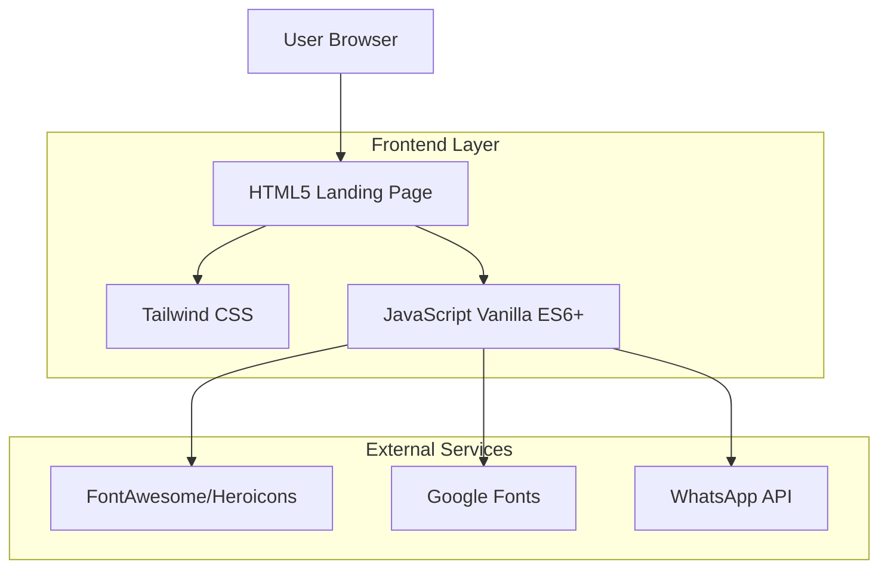

## 1. Architecture design



## 2. Technology Description
- Frontend: HTML5 + Tailwind CSS + JavaScript Vanilla ES6+
- CSS Framework: Tailwind CSS via CDN para prototipagem rápida
- Icons: FontAwesome ou Heroicons (SVG inline preferencial)
- Fonts: Google Fonts (Inter ou Roboto otimizado)
- Backend: None (landing page estática)

## 3. Route definitions
Esta é uma landing page single-page application (SPA) com navegação por âncoras:

| Route | Purpose |
|-------|---------|
| /#home | Hero section principal |
| /#sobre | Seção sobre e diferenciais |
| /#modalidades | Grid de modalidades oferecidas |
| /#horarios | Grade de horários das aulas |
| /#planos | Cards de planos e preços |
| /#contato | Informações de contato e footer |

## 4. API definitions
### 4.1 External APIs

WhatsApp Business API (via link direto)
```
https://wa.me/[numero]?text=[mensagem_pre_definida]
```

Request:
| Param Name| Param Type  | isRequired  | Description |
|-----------|-------------|-------------|-------------|
| numero    | string      | true        | Número de telefone da academia |
| mensagem  | string      | false       | Mensagem pré-preenchida para matrícula |

Exemplo:
```
https://wa.me/5562999999999?text=Olá!%20Gostaria%20de%20me%20matricular%20na%20academia.
```

## 5. Server architecture diagram
Não aplicável - landing page estática servida via CDN ou hosting estático.

## 6. Data model
Não aplicável - não há persistência de dados nesta landing page estática.

### 6.1 Performance Optimization Strategy
- **Critical CSS**: Tailwind CSS minificado via CDN
- **JavaScript**: Defer loading para não bloquear renderização
- **Imagens**: Lazy loading nativo com `loading="lazy"`
- **Fontes**: Preload de fonts críticas, font-display: swap
- **SEO**: Meta tags otimizadas, schema markup para local business
- **Acessibilidade**: Contraste WCAG 2.1 AA, atributos ARIA onde necessário

### 6.2 Lighthouse Targets
| Métrica | Target Score |
|---------|--------------|
| Performance | 95+ |
| Accessibility | 95+ |
| Best Practices | 95+ |
| SEO | 95+ |

### 6.3 File Structure
```
academia-performance/
├── index.html          # Landing page completa
├── assets/
│   ├── css/
│   │   └── custom.css  # Estilos adicionais se necessário
│   ├── js/
│   │   └── main.js     # JavaScript funcionalidades
│   └── img/
│       └── placeholder # Imagens otimizadas
└── README.md          # Documentação básica
```